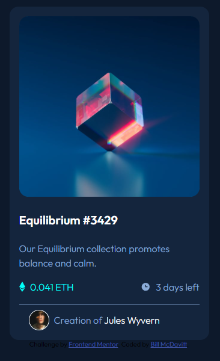
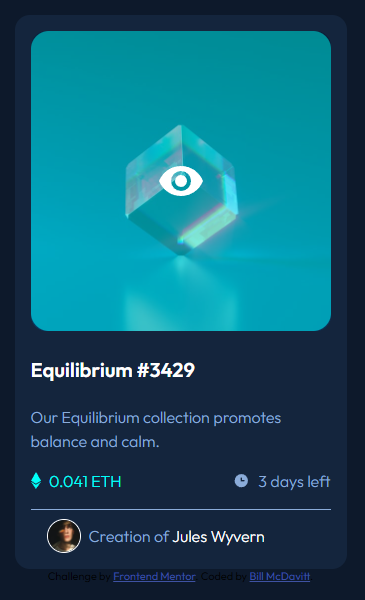

# Frontend Mentor - NFT preview card component solution

This is a solution to the [NFT preview card component challenge on Frontend Mentor](https://www.frontendmentor.io/challenges/nft-preview-card-component-SbdUL_w0U). Frontend Mentor challenges help you improve your coding skills by building realistic projects. 

## Table of contents

- [Overview](#overview)
  - [The challenge](#the-challenge)
  - [Screenshot](#screenshot)
  - [Links](#links)
- [My process](#my-process)
  - [Built with](#built-with)
  - [Useful resources](#useful-resources)
- [Author](#author)

**Note: Delete this note and update the table of contents based on what sections you keep.**

## Overview

### The challenge

Users should be able to:

- View the optimal layout depending on their device's screen size
- See hover states for interactive elements

### Screenshots





### Links

- Solution URL: [GitHub Repository](https://github.com/BMcdavitt/femNftPreview)
- Live Site URL: [Coming Soon](https://your-live-site-url.com)

## My process

### Built with

- Semantic HTML5 markup
- CSS custom properties

### What I learned

The most interesting part of this challenge was figuring out how to apply the highlight to the image.  My solution was based on an answer I found on stack overvlow.  The div containing the image was given a light blue background, and the image was displayed on top of it.  Then when a hover event is detected the image is set to 0.5 opacity allowing the background color to show through.  The effect is a good representaiton of highlighting the image on hover.  

```html
      <div class="imageBackground">
        
        
      </div>
```
```css
.imageBackground {
  position: relative;
  background-color: hsl(178, 100%, 50%);
  display: inline-block;
  margin: 0;
  border-radius: 18px;
  width: min(80vw, 300px);
  height: min(80vw, 300px);
}
```

Because of the display of the view svg image on top of the highlighted image moving the mouse over the view svg image would remove the highlighting.  To resolve this I moved away from a pure css solution to a javascript solution for detecting and applying the hover effect.

```js
  <script>
    function highlightCardImage() {
      document.getElementById('cardImage').style.opacity = '0.5'
      document.getElementById('cardImageView').style.display = 'block'
    }

    function unhighlightCardImage() {
      document.getElementById('cardImage').style.opacity = '1'
      document.getElementById('cardImageView').style.display = 'none'
    }
  </script>
```


### Useful resources

- [Stack Overflow Image Over Solution](https://stackoverflow.com/questions/23469332/highlight-images-on-hover-on-any-background)
- [Another Stack Overflow solution to displaying a horizontal line](https://stackoverflow.com/questions/14821087/horizontal-line-and-right-way-to-code-it-in-html-css)

## Author

- Frontend Mentor - [@BMcdavitt](https://www.frontendmentor.io/profile/BMcdavitt)
